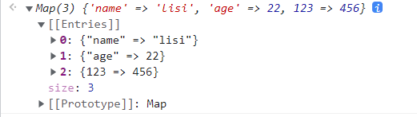
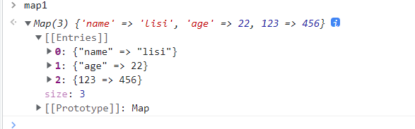
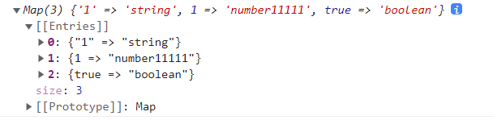
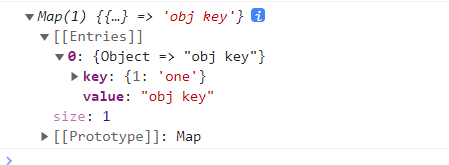
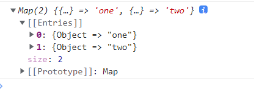
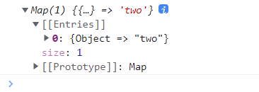
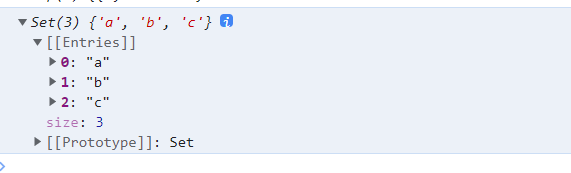

### 了解JavaScript中的Map和Set对象

ECMAScript 2015规范引入了两种新的可迭代对象类型:Map是键值对的有序集合；Set是唯一值的集合。在本文中将介绍这两个对象以及他们和Object和Array的相似或不同之处；

### Map

Map是键值对的集合，可以用任何的数据类型作为键，他拥有Object（唯一键值对集合）和Array（有序集合）的元素；但是在概念上更类似于Object，虽然他的大小和每一项的顺序像Array一样被保留，但是本身是像Object一样的键值对；

#### 使用 new Map() 实例化

```javascript
const map = new Map()
```
#### 添加值
使用set()方法向Mpa中添加值。第一个参数将是键，第二个参数将是值。
```javascript
map.set('name', 'lisi');
map.set('age', 22);
map.set(123, 456)
```

output:



在这里我们可以看到Map有索引，并且使用 => 表示键值对

#### 实例化传入初始值
除了给Map手动设置值外，我们还可以在实例化的时候传入初始值

```javascript
[ [ 'key1', 'value1'], ['key2', 'value2'] ]
```

```javascript
const map1 = new Map([
      ['name', 'lisi'],
      ['age', 22],
      [123, 456]
  ])
```

output



[ [ 'key1', 'value1'], ['key2', 'value2'] ] 与调用 Object.entries ()的结果相同。所以我们可以很方便的实现Object和Map之间的转换。

Object转Map

```javascript
const obj = {
    name: 'lisi',
    age: '22',
    123: 456
  }
const map2 = new Map(Object.entries(obj))
```

Map转Object

```javascript
const obj1 = Object.fromEntries(map2)
```
#### Map的keys

Map接受任何数据类型最为键，不允许出现重复的键值

```javascript
const map3 = new Map()
map3.set('1', 'string')
map3.set(1, 'number')
map3.set(1, 'number11111')
map3.set(true, 'boolean')
```

output



可以看到后面的 1 覆盖了前面的键为1的值，并且他把字符串的 “1” 和数字1都作为唯一的键。

尽管大家普遍的认为js中的对象已经可以处理数字、布尔值和其他原始数据类型作为键，但是事实并非如此，因为对象会把所有的键都更改为字符串。

例如用一个数字键初始化一个对象，并比较数字1和字符串“1”键的值：

```javascript
const obj = {1: 'one'};
console.log(obj[1] === obj['1']) // true
```

这就是为什么尝试使用一个对象作为键时，他会转成 [object Object]:

```javascript
const obj1 = {}
obj1[obj] = 'obj key';
console.log(obj1); // {[object Object]: 'obj key'}
```

那在Map中使用对象作为键，会是什么样呢？

```javascript
const map4 = new Map();
map4.set(obj, 'obj key');
console.log(map4);
```

output



可以看到把我们创建的obj对象作为了键。

在使用Object或Array作为键时，Map是通过他们的引用来判断是否是重复的键，来看两个例子：

1. 

```javascript
const map5 = new Map()
map5.set({}, 'one');
map5.set({}, 'two');
```

output



2. 

```javascript
const obj2 = {}
const map6 = new Map()
map6.set(obj2, 'one');
map6.set(obj2, 'two');
```

output



#### Map与Object比较

Map:
1. Map有一个大小的属性，Object没有一个内置的方法去查询他的大小；
2. Map是直接可迭代的，而Object不是；
3. Map在使用方面更具有灵活性，可以使用任何数据类型作为键；
4. Map保留了数据插入的顺序。

Object：
1. 可以完美地使用JSON.parse()和JSON.stringify()去和JSON格式数据去做一个转换；

2. 可以使用 Object.key 直接访问属性的值，不需向Map一样使用get()。

 **[访问](https://developer.mozilla.org/zh-CN/docs/Web/JavaScript/Reference/Global_Objects/Map)了解更多关于Map的知识点**

### Set

Set是唯一值的集合，在概念上更类似于数组，但是他并不是Array的替代品，而是为处理重复数据提供额外支持的补充。

#### 实例化

```javascript
const set = new Set()
```

使用add()方法添加值

```javascript
set.add('a');
set.add('b');
set.add('c');
set.add('a');
```

output



   由于Set只能包含唯一的值，所以后面添加进去的 ‘a’ 就被他忽略了。

也可以用一个数组来初始化Set。如果数组中有重复的值，它们将从Set中删除。

```javascript
const set2 = new Set(['a', 'b', 'c', 'a']);


output
Set(3) {'a', 'b', 'c'}
```

相反，只需一行代码，就可以将 Set 转换为 Array：

```javascript
const arr = [...set2]

output
(3) ['a', 'b', 'c']
```

这也就是数组去重的一个简便方法了。

 **[访问](https://developer.mozilla.org/zh-CN/docs/Web/JavaScript/Reference/Global_Objects/Set)了解更多关于Map的知识点**

   


